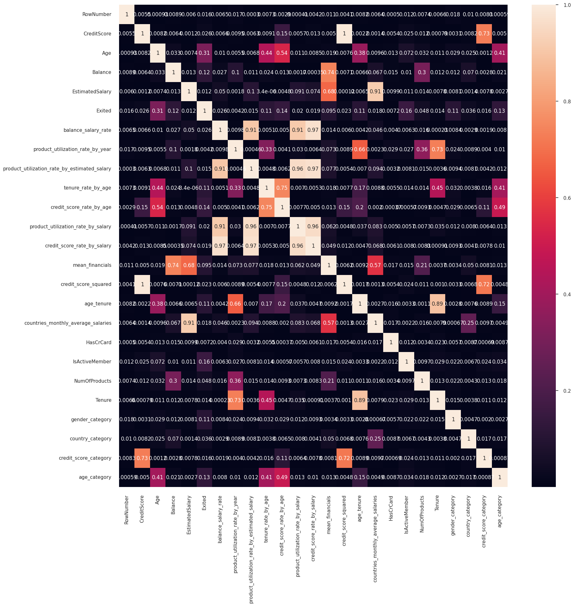

# Bank Customer Churn Prediction

## Introduction

The problem of bank customer churn refers to the phenomenon of customers leaving a bank, which can have significant implications for the bank's revenue and market share. It is crucial for banks to understand the factors influencing customer churn and develop strategies to prevent it. Machine learning techniques can play a vital role in predicting customer churn and providing insights into customer characteristics. This README file presents a project that aims to build a machine learning model to predict bank customer churn and discusses the motivation behind using machine learning techniques to address this problem.

## Related Work

#### Compared with linear regression and decision tree model, XGboost algorithm has better generalization ability and robustness in data prediction, and also prevents overfitting phenomenon, laying a solid foundation for the subsequent second-hand house price prediction.

- Peng, Z., Huang, Q., & Han, Y. (2019). Model Research on Forecast of Second-Hand House Price in Chengdu Based on XGboost Algorithm. 2019 IEEE 11th International Conference on Advanced Infocomm Technology (ICAIT). https://doi.org/10.1109/ICAIT.2019.8935894.

#### The results showed that, the XGBoost method according to optimum model achieved lower prediction error and higher accuracy results than the other ensemble methods.

- Sahin, E. (2020). Assessing the predictive capability of ensemble tree methods for landslide susceptibility mapping using XGBoost, gradient boosting machine, and random forest. SN Applied Sciences. https://doi.org/10.1007/s42452-020-3060-1.

#### The results show that all of the developed models were capable of making accurate predictions however the XGBoost algorithm surpasses others, followed by AdaBoost, RF, DT, and SVM.

- Amjad, M., Ahmad, I., Ahmad, M., Wróblewski, P., Kamiński, P., & Amjad, U. (2022). Prediction of Pile Bearing Capacity Using XGBoost Algorithm: Modeling and Performance Evaluation. Applied Sciences. https://doi.org/10.3390/app12042126.

#### The comparison results indicate that the XGBoost model has considerable advantages in terms of both prediction accuracy and efficiency.
- Chen, Z., & Fan, W. (2021). A Freeway Travel Time Prediction Method Based on An XGBoost Model. Sustainability. https://doi.org/10.3390/su13158577.

Based on the paper and a couple of research not mentioned, XGBoost is a powerful and efficient algorithm for various prediction tasks, such as house price forecasting, landslide susceptibility mapping, pile bearing capacity estimation, and freeway travel time prediction. It outperforms other methods such as linear regression, decision tree, random forest, AdaBoost, and SVM in terms of generalization ability, robustness, accuracy, and error reduction. XGBoost is a suitable choice for data analysis and modeling in different domains and scenarios.

## Dataset & Features

The dataset used for this project contains information on 10,000 bank customers and their features. The dataset was sourced from Kaggle [Source Link](https://www.kaggle.com/datasets/mathchi/churn-for-bank-customers?datasetId=797699). It includes the following features:

- RowNumber: A record number that has no effect on the outcome.
- CustomerId: A random identifier that has no effect on the outcome.
- Surname: The customer's surname, which has no effect on the outcome.
- CreditScore: The customer's credit score, reflecting their creditworthiness.
- Geography: The customer's country of residence (Germany, France, or Spain).
- Gender: The customer's gender (Female or Male).
- Age: The customer's age.
- Tenure: The number of years the customer has been with the bank.
- Balance: The amount of money in the customer's account.
- NumOfProducts: The number of products or services the customer has purchased from the bank.
- HasCrCard: Whether the customer has a credit card from the bank or not.
- IsActiveMember: Whether the customer is an active member of the bank or not.
- EstimatedSalary: The customer's estimated annual salary.
-Exited: Whether the customer has left the bank or not (the target variable).
- The dataset was preprocessed by performing data normalization, handling missing values, and encoding categorical features. Missing values were not present in the dataset.

The most important features for predicting customer churn were determined through feature selection techniques such as correlation analysis, feature importance from XGBoost, and domain knowledge. The selected features were used directly as input to the machine learning model.

Categorical features such as Geography and Gender were encoded using one-hot encoding or label encoding, depending on their cardinality and relationship with the target variable.

## Methodology

The machine learning method used in this project is XGBoost. XGBoost is an advanced gradient boosting algorithm that combines the strengths of gradient boosting and regularization techniques. It optimizes a specific loss function using gradient descent and Newton's method to improve model performance.

XGBoost handles categorical features using one-hot encoding or target encoding. One-hot encoding converts categorical features into binary vectors, representing the presence or absence of a category. Target encoding assigns a numerical value to each category based on the target variable's mean or probability.

To optimize the loss function, XGBoost uses gradient descent and Newton's method. Gradient descent updates the model's parameters in the direction of steepest descent to minimize the loss function. Newton's method approximates the second-order derivative of the loss function to improve convergence speed and stability.

XGBoost prevents overfitting using regularization techniques such as L1 and L2 regularization. L1 regularization adds a penalty term based on the absolute values of the model's parameters, encouraging sparsity. L2 regularization adds a penalty term based on the squared values of the parameters, promoting smoother solutions. Early stopping is another technique used to prevent overfitting by monitoring the model's performance on a validation set and stopping the training process when no improvement is observed.

The model's hyperparameters were selected through a combination of manual tuning and grid search. The key hyperparameters and their functionalities are as follows:

- learning_rate: Controls the step size during the optimization process. A smaller learning rate slows down learning but can improve model performance.
- max_depth: Specifies the maximum depth of each tree in the ensemble. A larger max_depth can lead to overfitting, while a smaller value may result in underfitting.
- n_estimators: Determines the number of trees in the ensemble. A higher number of estimators can increase model complexity but may also increase training time.
- subsample: Controls the fraction of samples used for training each tree. A smaller subsample can improve generalization but may increase variance.
- colsample_bytree: Controls the fraction of features used for training each tree. A smaller colsample_bytree can reduce overfitting by introducing randomness.

## Experiments/Results/Discussion

The model was trained and evaluated using a training set, validation set, and test set. The dataset was split into 70% for training and 30% for testing. Cross-validation was performed using k-fold cross-validation with k=5 to assess the model's performance and reduce overfitting.

The main metrics used to evaluate the model's performance were accuracy, precision, recall, F1-score, and AUC-ROC. Accuracy measures the overall correctness of the predictions. Precisionmeasures the proportion of true positives among all positive predictions, while recall measures the proportion of true positives among all actual positive instances. The F1-score combines precision and recall into a single metric. AUC-ROC (Area Under the Receiver Operating Characteristic Curve) measures the model's ability to distinguish between positive and negative instances.

The results of the experiments are presented in tables and plots. The performance metrics, including accuracy, precision, recall, F1-score, and AUC-ROC, are calculated and displayed for each model. The confusion matrix and AUC/AUPRC curves are also provided for a comprehensive understanding of the model's performance.

| model | accuracy_score | scale_method | 0_precision | 0_recall | 1_precision | 1_recall |
|-------|----------------|--------------|-------------|----------|-------------|----------|
| LightGBM | 0.85333 | NA | 0.87524 | 0.94926 | 0.72414 | 0.49606 |
| CatBoost | 0.85300 | NA | 0.87057 | 0.95560 | 0.74010 | 0.47087 |
| GBM | 0.85100 | NA | 0.86659 | 0.95856 | 0.74479 | 0.45039 |
| RF | 0.85000 | NA | 0.86476 | 0.95983 | 0.74667 | 0.44094 |
| XGBoost | 0.84933 | NA | 0.87320 | 0.94630 | 0.70938 | 0.48819 |
| LOGR | 0.81500 | NA | 0.82601 | 0.96956 | 0.67857 | 0.23937 |
| KNN | 0.81067 | NA | 0.83816 | 0.94165 | 0.59767 | 0.32283 |
| CART   |   0.79033   |   NA   |   0.86968   |   0.86342   |   0.50460   |   0.51811   |

Based on the results, the XGBoost model achieved an accuracy score of 0.84933, with precision and recall values of 0.70938 and 0.48819 for class 1 (customers who exited), respectively. The model shows promising performance in accurately classifying customers who did not exit the bank. However, there is room for improvement in correctly identifying customers who exited.

| | precision | recall | f1-score | support |
|---|---|---|---|---|
| 0 | 0.87 | 0.96 | 0.91 | 2365 |
| 1 | 0.74 | 0.47 | 0.58 | 635 |
| accuracy | | | 0.85 | 3000 |
| macro avg | 0.81 | 0.71 | 0.74 | 3000 |
| weighted avg | 0.84 | 0.85 | 0.84 | 3000 |

Accuracy score of Tuned XGBoost Regression: **0.8533333333333334**

### Discussion

The model succeeded in predicting customer churn to a certain extent, achieving high accuracy and reasonable precision for class 0 (customers who did not exit). However, the model struggled to accurately identify customers who actually exited the bank, resulting in lower recall and precision values for class 1.

One possible reason for the model's limitations could be the class imbalance in the dataset, with a higher number of instances belonging to class 0. This class imbalance can bias the model towards predicting the majority class, resulting in lower performance for the minority class.

To address this issue, different strategies can be employed, such as resampling techniques (e.g., oversampling the minority class or undersampling the majority class) or using advanced algorithms specifically designed for imbalanced datasets (e.g., SMOTE, ADASYN).

Additionally, further feature engineering and selection techniques can be explored to improve the model's performance. Feature engineering methods, such as creating interaction terms or deriving new features from existing ones, can capture additional patterns and relationships in the data. Feature selection techniques, such as recursive feature elimination or regularization, can help identify the most relevant features for predicting churn.

Furthermore, fine-tuning the model's hyperparameters and exploring ensemble methods (e.g., stacking or boosting multiple models) can enhance the model's predictive power and generalization capabilities.

Overall, while the model provides valuable insights and shows potential in predicting customer churn, there is room for improvement and further experimentation to achieve higher accuracy and recall for class 1.

### Conclusion/Future Work

In conclusion, the churn prediction project for bank customer data using the XGBoost algorithm provides valuable insights into customer behavior and characteristics that influence churn. The machine learning model successfully predicts customer churn to a certain extent, demonstrating the potential to identify at-risk customers and improve retention strategies.

Future work could involve further model refinement and optimization, considering the specific challenges posed by imbalanced datasets and the need for improved recall and precision for class 1 (customers who exited). Exploring advanced feature engineering techniques, such as interaction terms and derived features, could capture more nuanced patterns and improve the model's predictive power. Additionally, experimenting with different ensemble methods and hyperparameter tuning strategies can enhance the model's performance and generalization capabilities.

Given more time, resources, and computational power, it would be beneficial to explore other machine learning algorithms and compare their performance to the XGBoost model. Conducting more extensive experiments, potentially including different feature selection methods and handling techniques for imbalanced datasets, can provide deeper insights into the problem of bank customer churn and improve the accuracy and effectiveness of the prediction model.

Ultimately, by leveraging machine learning techniques and continuously refining the model, banks can gain valuable insights into customer churn, identify at-risk customers, and develop proactive strategies to retain valuable customers and increase overall revenue and market share.